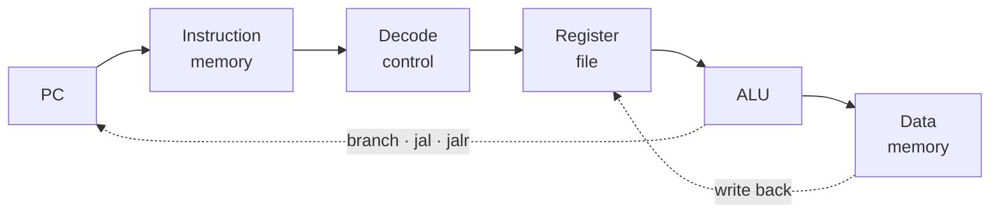

# RISC-V SINGLE-CYCLE PROCESSOR

### One instruction, one clock cycle: the baseline

**VHDL · RV32I · QuestaSim**

Iowa State University · CprE 381 · Project Group F_04

[Overview](#overview) · [Datapath](#datapath) · [My role](#my-role) · [Results](#results) · [Limitations](#limitations-and-next-steps)

---

> **Where it stands — Complete**  
> Runs the course test programs with a CPI of about 1.  
> The 41.40 ns clock period is what the two pipelined designs set out to beat.

| Clock period | Max frequency | CPI | Mergesort |
| :---: | :---: | :---: | :---: |
| **41.40 ns** | **≈ 24.2 MHz** | **≈ 1.00** | **70,214 ns** |

| | |
|---|---|
| Period | October 2025 |
| Team | 2 — Jongwoo Kim, Veda Vegiraju (Project Group F_04) |
| My role | Control unit, fetch logic, ALU and datapath integration, testbenches |
| Stack | VHDL, RISC-V assembly, QuestaSim, RARS, course toolflow |

## Overview

Every instruction completes in one clock cycle. The design is simple to reason about, but the slowest instruction sets the clock period for all of them.

- **Why:** it is the reference point. The two pipelined processors that follow are measured against it.
- **What it contains:** a 32-bit ALU built up from gates (ripple-carry adder, logic unit, barrel shifter, set-less-than), a control unit and ALU control, immediate generation, a register file, and fetch logic that handles branches, `jal` and `jalr`.

## Datapath

Everything on this path happens in a single cycle.

## My role

The commits in this repository are mine. I wrote the control unit from an instruction-by-signal table, rewrote the fetch logic to support `jalr`, integrated the datapath, and wrote testbenches for the control unit and ALU. The report was written with my teammate.

## What I learned

**Technical**
- Turning a table of instructions and control signals into decode logic, and checking it with a testbench before integration.
- Why logical and arithmetic right shifts differ, and how one barrel shifter can do left shifts by reversing its input and output.
- How `slt` and the Zero flag fall out of the subtractor.
- Reading waveforms to trace one instruction through the datapath.

**Teamwork**
- Agreeing on signal names and module interfaces before splitting the work.
- Reorganizing a shared file tree mid-project without breaking the other person's work.

## Resources used

- Patterson and Hennessy, *Computer Organization and Design: RISC-V Edition*
- Course toolflow and lecture material, the RISC-V unprivileged specification
- QuestaSim for simulation, RARS for assembling test programs

## Results

- Runs the course test programs in `riscv/` (`addiseq`, `fibonacci`, `grendel`, `lab3Seq`, `simplebranch`).
- Cycles per instruction is about 1.00 (Mergesort: 1,696 cycles for 1,695 instructions).
- Maximum clock period 41.40 ns; Mergesort completes in 70,214 ns.

## Limitations and next steps

- The 41.40 ns period comes from the longest path through fetch, decode, ALU, memory and write-back in one cycle.
- The adder is ripple-carry; a carry-lookahead adder would shorten that path.
- The file tree holds duplicated copies of some ALU sub-modules that should be merged.
- Next step: pipelining, done in the two repositories below.

## The three processors

This repository is one of three from the same term project.

| Stage | Repository | Max clock period | Max frequency |
|---|---|---|---|
| Single-cycle | [Project-Part-1-RISC-V-Single-cycle-Processor](https://github.com/devjwk/Project-Part-1-RISC-V-Single-cycle-Processor) | 41.40 ns | about 24.2 MHz |
| Software-scheduled pipeline | [Project-Part-2](https://github.com/devjwk/Project-Part-2) | 16.80 ns | 59.53 MHz |
| Hardware-scheduled pipeline | [Project-Part-1](https://github.com/devjwk/Project-Part-1) | 25.43 ns | 39.33 MHz |
